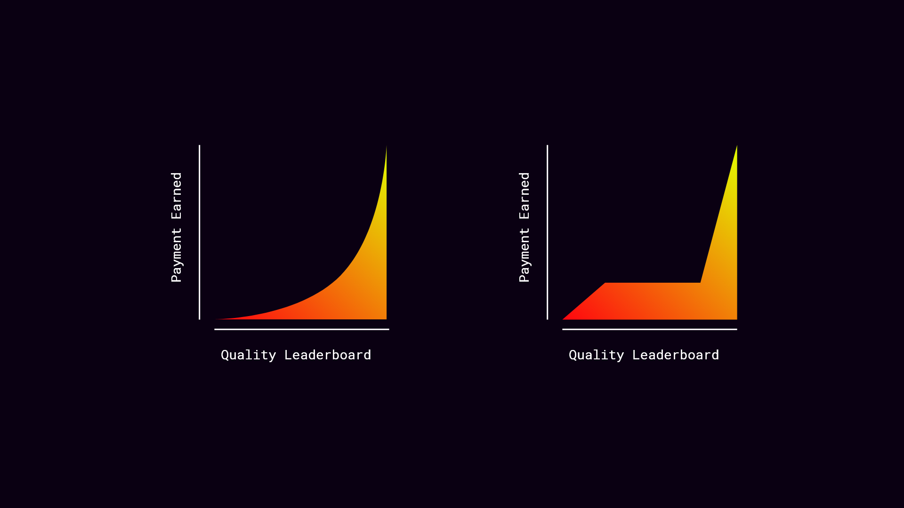

# Transform Curve

TransformCurve is a contract that implements the ability to define any curve on chain with the usage of circular transforms. Inputs are specified as circles with a radius, frequency and phase. The transform function takes in a circle and returns a new circle. 

The transform function is applied to the input circle and the result is used as the input for the next transform. The output of the last transform is the output of the curve.

This implementation relies heavily on [Solidity Trigonemtry](https://github.com/mds1/solidity-trigonometry) that enables the use of trigonometric functions in Solidity.

Traditionally, the implementation of an on-chain curve has been limited to the algebraic functions hard-coded into a contract. While not all curves make sense to be used in all cases, they *can exist* with this model -- Goodbye opinion and hello design space!

In action, this means that one can enjoy a world like:

Due to the surrounding complexity of this idea, you can find a more detailed explanation of the implementation in the [Transform Curve](./docs/transform-curve.md) (coming soon) document.

Functionally, this is as simple as discrete math implementation of a contiuous function.

The margin of error is extremely small and can be improved with the use of $N$ as *curve clarity*. The higher the $N$, the more accurate the curve will be.

A low number of $N$ will result in a lower gas cost for the curve evaluation. Additionally, when there are few circles and the values are small, the error is negligible. However, if the values are large, the error will be larger and thus the curve will be less accurate. This can be countered (to an extent) with the increase of $N$.

To implement this, we use the following formula:

$$
\begin{aligned}
\theta &= \frac{2 \pi}{N} \\
x &= r \cos(\theta) \\
y &= r \sin(\theta)
\end{aligned}
$$

Where $r$ is the radius of the circle, $N$ is the number of points in the curve and $\theta$ is the angle of the point.

This enables the ability to construct curves using (a far more detailed process than illustrated below) such as:

If you would like a more detailed explanation of the implementation, join [cosanostra](https://cosanostra.gg) on [Discord](https://discord.com/invite/TASvMj4vyk).